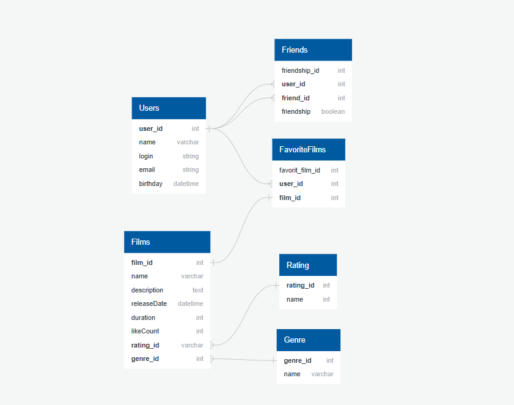

# java-filmorate
Template repository for Filmorate project.



### Список пользователей 

```sql
SELECT name, 
    login,
    email,
    birthday
FROM Users;
```

### Список друзей пользователя

```sql
SELECT u.name
FROM Users AS u
LEFT JOIN Friends AS f ON u.user_id=f.user_id
WHERE u.user_id = 1 AND friendship = 'TRUE';
```

### Список фильмов 

```sql
SELECT name, 
    description,
    releaseDate,
    duration,
    likeCount,
    r.name,
    g.name
FROM Films AS f
LEFT JOIN Rating AS r ON f.rating_id=r.rating_id
LEFT JOIN Genre AS g ON f.genre_id=f.genre_id;
```

### Список лайкнутых фильмов пользователем

```sql
SELECT f.name
FROM Films AS f
RIGHT JOIN FavoriteFilms AS ff ON f.film_id=ff.film_id
WHERE f.user_id = 1;
```

### Топ 10 лайкнутых фильмов

```sql
SELECT f.name
FROM (SELECT film_id
     FROM FavoriteFilms AS ff
     GROUP BY film_id
     ORDER BY COUNT(user_id) DESC
     LIMIT 10) AS top
LEFT JOIN Films AS f ON ff.film_id=f.film_id    
```


