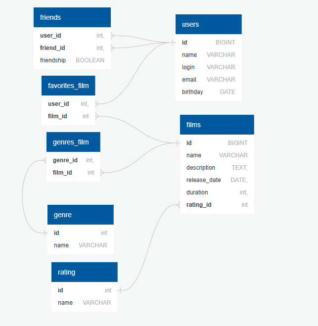

# java-filmorate
Template repository for Filmorate project.



### Список пользователей

```sql
SELECT *
FROM Users;
```

### Список фильмов

```sql
SELECT * 
FROM films
```

### Получить фильм по id

```sql
SELECT * 
FROM films
WHERE id = 1
```

### Топ 10 фильмов

```sql
SELECT * 
FROM films as f
RIGHT JOIN (SELECT film_id, COUNT(user_id) FROM favorites_film
GROUP BY film_id
ORDER BY COUNT(user_id) DESC) as ff ON f.id = ff.film_id
LIMIT 10
```

### Список жанров

```sql
SELECT * 
FROM genre  
```

### Жанр по id

```sql
SELECT * 
FROM genre 
WHERE id = ?   
```

### Список жанров фильма

```sql
SELECT * 
FROM genres_film 
WHERE film_id = 1
ORDER BY genre_id    
```

### Список mpa

```sql
SELECT * 
FROM rating    
```

### Mpa фильма

```sql
SELECT * 
FROM rating 
WHERE id = 1   
```

### Пользователь по id

```sql
SELECT * 
FROM users 
WHERE id = 1  
```

### Список друзей

```sql
SELECT u.*
FROM users AS u
JOIN (SELECT friend_id FROM friends WHERE user_id = ?) AS f ON u.id = f.friend_id 
```

### Список общих друзей двух пользователей

```sql
SELECT * FROM users as u
JOIN (SELECT friend_id FROM friends WHERE user_id = ?) as f1 ON u.id = f1.friend_id
JOIN (SELECT friend_id FROM friends WHERE user_id = ?) as f2 ON u.id = f2.friend_id   
```